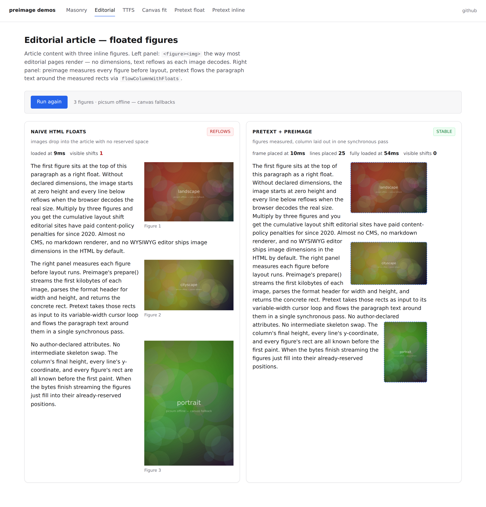
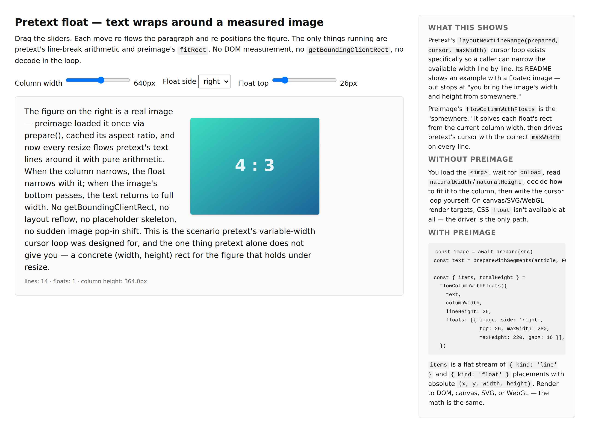
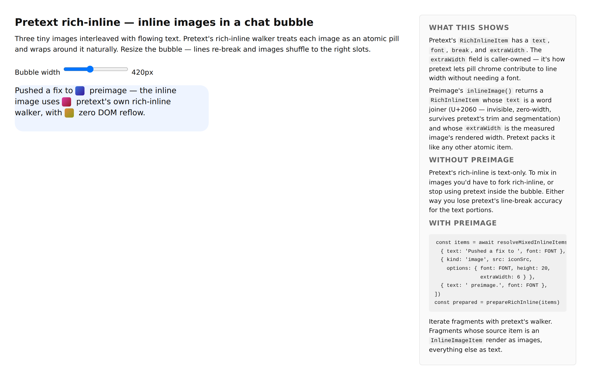
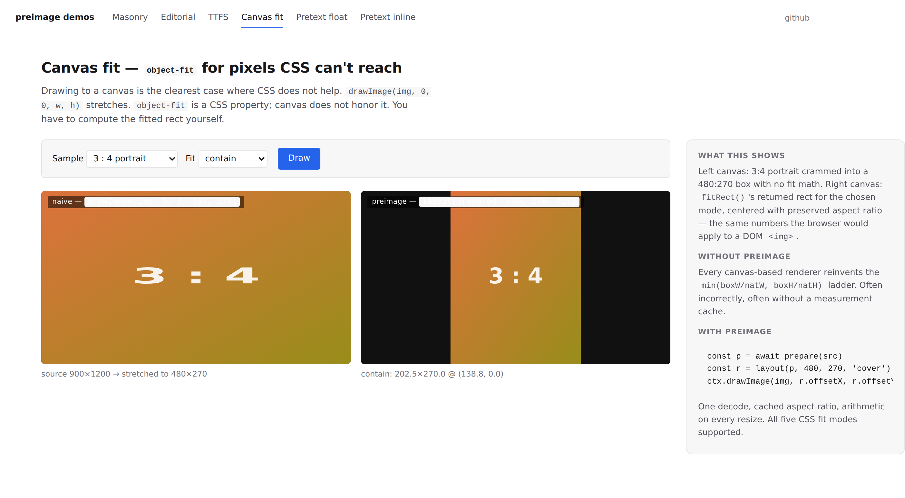
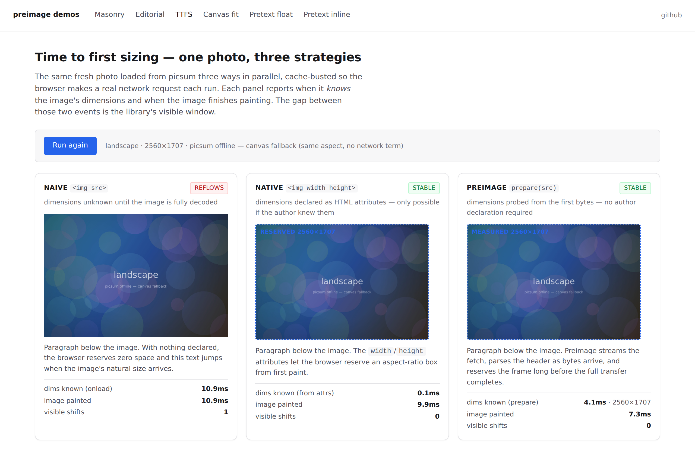

# Preimage

Measured images for [pretext](https://github.com/chenglou/pretext): float figures and inline images in pretext-flowed text, without triggering DOM reflow.

Pretext's variable-width cursor loop — its `layoutNextLineRange(prepared, cursor, maxWidth)` API — is built for exactly the scenarios where a figure sits beside a column of text and each line has to know how wide it's allowed to be. Pretext deliberately stops short of computing the figure: it takes `{ width, height, bottom }` as input and leaves the question of *how you got those numbers* to the caller.

Preimage answers that question. It loads and decodes images once (via `HTMLImageElement.decode()`), caches their intrinsic size and aspect ratio, and provides two adapters that plug straight into pretext:

- **`flowColumnWithFloats`** — drives pretext's cursor loop, reserves horizontal space for a floated image, yields a stream of placed lines + placed images with absolute `(x, y, w, h)`.
- **`inlineImage` / `resolveMixedInlineItems`** — return pretext `RichInlineItem` values whose `extraWidth` reserves the measured image's rendered width, so pretext's rich-inline walker treats it as an atomic pill that wraps naturally with surrounding text.

Plus the primitives those adapters are built on — `prepare`, `layout`, `fitRect`, EXIF orientation handling, SVG viewBox extraction, and byte-level `probeImageBytes` for File/Blob sources.

## Demos at a glance

| | |
|---|---|
| **[Masonry](./pages/demos/masonry.html)** — ~60 fresh photos into a grid. Left: naive ``, layout shifts on every image decode. Right: `prepare()` each image then place by measured aspect ratio — the grid is stable from the first frame. |  |
| **[Editorial](./pages/demos/editorial.html)** — article with 3 floated figures. Left: naive HTML, text reflows as each figure loads. Right: pretext + preimage via `flowColumnWithFloats`, layout stable from first frame. |  |
| **[Pretext float](./pages/demos/pretext-float.html)** — paragraph wrapping around a measured figure. Column width, float side, and float top are live-editable; every change re-flows on pure arithmetic. |  |
| **[Pretext rich-inline](./pages/demos/pretext-inline.html)** — chat bubble with three inline icon images. Resizing the bubble re-breaks the lines and shuffles the icons to their new slots. |  |
| **[Canvas fit](./pages/demos/canvas-fit.html)** — `drawImage` stretch vs `layout()` fit math. The standalone (no-pretext) case where canvas can't fall back on CSS `object-fit`. |  |
| **[Time-to-first-sizing](./pages/demos/ttfs.html)** — `prepare` in default (byte-probe) vs `image-element` strategy on an 11MB PNG Blob. Byte-probe returns in ~700µs; full decode takes ~374ms. |  |

Run them live with `bun install && bun start` and open [`/demos`](http://localhost:3000/).

## `prepare`: time-to-first-sizing

`prepare(src)` returns dimensions as fast as the platform allows. By default it streams the fetch for URLs and byte-probes the first chunk (~150ms for remote photos); for `Blob`/`File` sources it slices the first 4KB and probes (~5ms). The classic `HTMLImageElement.decode()` path is available as a fallback and via an opt-out strategy.

```ts
import { prepare, getMeasurement } from '@somnai-dreams/preimage'

// URL — streams + probes
const hero = await prepare('/hero.jpg')
const m = getMeasurement(hero)
// m.naturalWidth / m.naturalHeight ready in ~150ms, not ~4000ms
// m.blobUrl — the streamed blob exposed as an object URL;  reuses it

// Blob — slices + probes
const file = inputEl.files[0]
const prepared = await prepare(file)
// dimensions in ~5ms, no decode

// Opt out of streaming for specific calls (e.g. to guarantee no fetch is issued)
await prepare('/hero.jpg', { strategy: 'image-element' })
```

Covers **PNG, JPEG, WebP, GIF, BMP, SVG** via pure byte parsers. **AVIF / HEIC / anything unknown** falls back transparently to `createImageBitmap(blob)` — still faster than a round trip because the bytes are already buffered, just without the first-2KB shortcut. `strategy` accepts `'auto'` (default), `'stream'` (require streaming, error on failure), or `'image-element'` (force classic path).

## Installation

```sh
npm install @somnai-dreams/preimage @chenglou/pretext
```

Pretext is a `peerDependency` — the main entry (`@somnai-dreams/preimage`) does not import it, but the `@somnai-dreams/preimage/pretext` subpath does.

## The pretext integration

### 1. Float a figure beside a pretext text column

```ts
import { prepareWithSegments, materializeLineRange } from '@chenglou/pretext'
import { prepare } from '@somnai-dreams/preimage'
import { flowColumnWithFloats } from '@somnai-dreams/preimage/pretext'

const image = await prepare('/figure.jpg')        // one decode, aspect cached
const text = prepareWithSegments(article, FONT)   // pretext's one-time pass

const { items, totalHeight } = flowColumnWithFloats({
  text,
  columnWidth,
  lineHeight: 26,
  floats: [
    { image, side: 'right', top: 26, maxWidth: 280, maxHeight: 220, gapX: 16 },
  ],
})

for (const item of items) {
  if (item.kind === 'line') {
    const line = materializeLineRange(text, item.range)
    ctx.fillText(line.text, item.x, item.y)
  } else {
    ctx.drawImage(bitmap, item.x, item.y, item.width, item.height)
  }
}
```

The driver solves each float's rect against the column width, tracks which floats are active at each `y`, narrows pretext's `maxWidth` when one is, and emits placed lines that skip past the float's horizontal footprint. `totalHeight` is the greater of the last line's baseline and the lowest float's bottom. No DOM reads, no reflow, same data on every resize.

`solveFloat(spec, columnWidth)` is the low-level version — just the `{ width, height }` for one floated image, for callers that want to drive pretext's loop themselves.

### 2. Inline a measured image inside pretext's rich-inline flow

```ts
import {
  prepareRichInline,
  walkRichInlineLineRanges,
  materializeRichInlineLineRange,
} from '@chenglou/pretext/rich-inline'
import {
  resolveMixedInlineItems,
  isInlineImageItem,
} from '@somnai-dreams/preimage/pretext'

const items = await resolveMixedInlineItems([
  { text: 'Pushed a fix to ', font: FONT },
  { kind: 'image', src: iconSrc, options: { font: FONT, height: 20, extraWidth: 6 } },
  { text: ' preimage', font: FONT },
])
const prepared = prepareRichInline(items)

walkRichInlineLineRanges(prepared, maxWidth, (range) => {
  const line = materializeRichInlineLineRange(prepared, range)
  for (const frag of line.fragments) {
    const item = items[frag.itemIndex]
    if (isInlineImageItem(item)) drawInlineImage(item, frag)
    else drawInlineText(item, frag)
  }
})
```

`inlineImage(src, options)` returns a `RichInlineItem` whose `text` is a single word joiner (U+2060 — invisible, zero-width, survives both pretext's `[ \t\n\f\r]+` trim and its soft-break-only drop) and whose `extraWidth` is the measured image's rendered width plus any caller-supplied chrome. Pretext packs it as an atomic pill with `break: 'never'` by default.

The returned item also carries `imageDisplayWidth`, `imageDisplayHeight`, and a reference to the `PreparedImage`, so the caller has everything it needs to render the image at the fragment's computed position.

`inlineImageItem(preparedImage, options)` is the sync version for callers that already have the image measured (useful when the whole rich-inline flow is being rebuilt on every keystroke, but the images were prepared once).

## API glossary

### Core primitives (`@somnai-dreams/preimage`)

```ts
prepare(src: string, options?: PrepareOptions): Promise<PreparedImage>
  // one-time load + decode + measurement pass, returns an opaque handle.

prepareSync(src, width, height, { orientation? }?): PreparedImage
  // skip the network when your server already reports intrinsic dimensions.

layout(prepared, maxWidth, maxHeight?, fit?): FittedRect
  // CSS object-fit math over the cached aspect ratio. No DOM reads.
  // `fit` is 'contain' | 'cover' | 'fill' | 'scale-down' | 'none'.

measureAspect(prepared): number
measureNaturalSize(prepared): { width: number, height: number }
getMeasurement(prepared): ImageMeasurement  // full record (EXIF, format, …)

fitRect(natW, natH, boxW, boxH, fit?): FittedRect
  // the object-fit math as a standalone pure function. Used internally by
  // `layout()` and `solveFloat()`; exposed because it's handy.

measureImage(src, options?): Promise<ImageMeasurement>
recordKnownMeasurement(src, w, h, { orientation?, decoded? }?): ImageMeasurement
measureFromSvgText(svgText): { width, height } | null
readExifOrientation(buffer): OrientationCode | null
clearCache(): void
```

### Pretext integration (`@somnai-dreams/preimage/pretext`)

```ts
solveFloat(spec, columnWidth): { width, height }
flowColumnWithFloats({ text, columnWidth, lineHeight, floats }): ColumnFlowResult
measureColumnFlow(opts): { totalHeight, lineCount }

inlineImage(src, options): Promise<InlineImageItem>
inlineImageItem(preparedImage, options): InlineImageItem
resolveMixedInlineItems(items): Promise<RichInlineItem[]>
isInlineImageItem(item): item is InlineImageItem
```

Shapes:

```ts
type FloatSpec = {
  image: PreparedImage
  side: 'left' | 'right'
  top: number          // measured from column y=0
  maxWidth: number
  maxHeight?: number
  gapX?: number        // horizontal gap between float and flowing text (default 12)
  gapY?: number        // vertical gap above/below the float for line overlap (default 0)
}

type ColumnFlowItem =
  | { kind: 'line'; y, x, width; range: LayoutLineRange }   // pretext's LayoutLineRange
  | { kind: 'float'; y, x, width, height; image; itemIndex; side }

type InlineImageItem = RichInlineItem & {
  __preimageInline: true
  image: PreparedImage
  imageDisplayWidth: number   // aspectRatio * options.height
  imageDisplayHeight: number  // options.height
  chromeWidth: number         // non-image extraWidth
}
```

## Why these two integrations, and nothing else

Pretext solves a sharp problem: "measure text without triggering reflow, then do line breaking with pure arithmetic." Preimage's job is to deliver the *one other input* pretext needs to cover the scenarios its own README describes:

- editorial article layout with floated figures
- markdown / rich-note with inline icon images
- chat bubbles with inline image attachments
- masonry / column layouts that mix text and image cards

For anything else images can do in a browser, CSS and the platform already have better answers: `aspect-ratio` handles CLS, `object-fit` handles single-image fitting inside a CSS box, `<picture>` handles responsive sources. Preimage does not try to reinvent any of those. It fills the specific gap where a JS layout engine — pretext — needs numeric dimensions *before* paint to decide how text wraps around an image.

## Caveats

- The inline adapter's word-joiner (U+2060) sentinel measures 0px in every font we've tested. If you hit a font that gives `⁠` a non-zero glyph width, the reserved width will be off by that amount. Report it.
- `flowColumnWithFloats` currently handles any number of floats, but a line's available width is always calculated as `columnWidth - (widest active left float) - (widest active right float) - gaps`. Side-by-side floats on the same side stack to the full width of the larger one, not sum to both — matching how CSS floats behave.
- EXIF orientations 1–8 are respected for measurement axes; canvas rendering still needs to apply the transform manually. Browser `` rendering applies it automatically.
- SVG without an intrinsic size falls back to `300 × 150` (CSS default). Use `measureFromSvgText` for the viewBox if that matters.

## Develop

See [DEVELOPMENT.md](DEVELOPMENT.md).

## Credits

Built on top of Chenglou's [pretext](https://github.com/chenglou/pretext). The two-phase prepare/layout split, the opaque prepared handle, and the cursor-driven streaming API are all pretext's design; preimage just follows its shape for the image side of the same problems.
